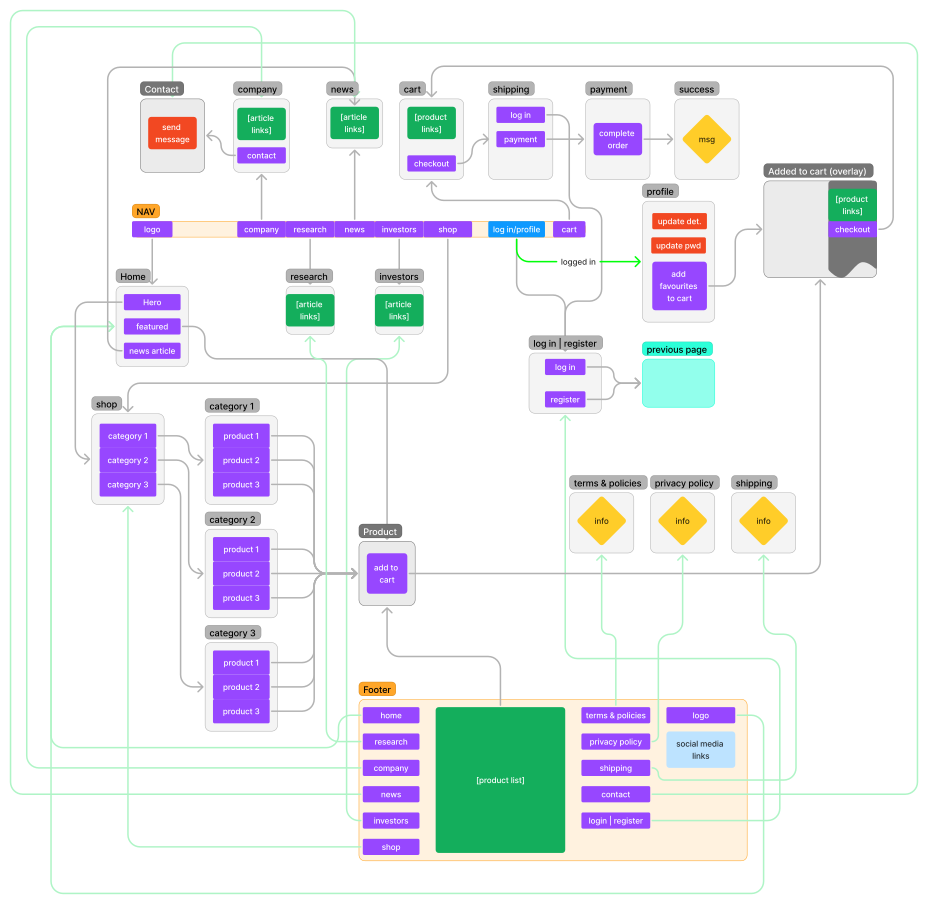
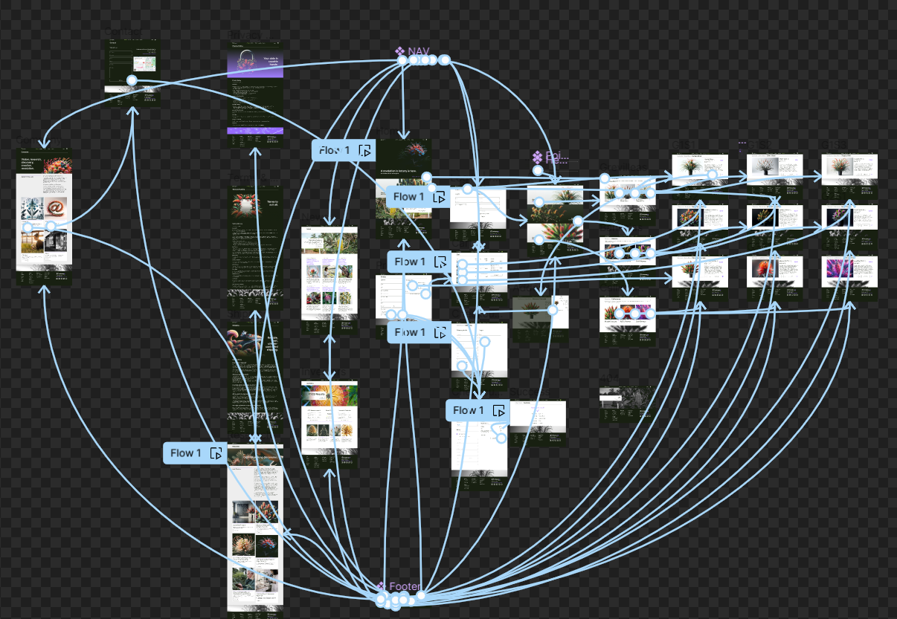

# Responsive Frontend Website

Welcome to my responsive frontend website project! 

## Table of Contents

- [Responsive Frontend Website](#responsive-frontend-website)
  - [Table of Contents](#table-of-contents)
  - [Project Overview](#project-overview)
  - [Wireframe and prototype](#wireframe-and-prototype)
  - [Features](#features)
  - [Technologies Used](#technologies-used)
  - [Contact](#contact)

## Project Overview

This project was undertaken as part of my ongoing IT studies and is based off a fictional genetic engineering company named "Protaeceae". This project aims to create a responsive company portfolio and e-commerce platform that allows users to browse company info, news, research, products, add products to the cart, and proceed to checkout. The design is optimized for both desktop and mobile devices, including tablets.

## Wireframe and prototype

This project was wireframed and prototyped in Figma.

## Features

- Responsive design for mobile, tablet and desktop
- Product listings with detailed information
- Shopping cart functionality
- User-friendly navigation

## Technologies Used

- **Frontend:**
  - HTML5
  - CSS3
  - JavaScript (ES6+)
  - Bootstrap 

- **Deployment:**
  - [GitHub Pages](https://jayeveringham.github.io/Protaeceae/) 

## Contact

If you have any questions, feel free to contact me at jay.e@posteo.net
